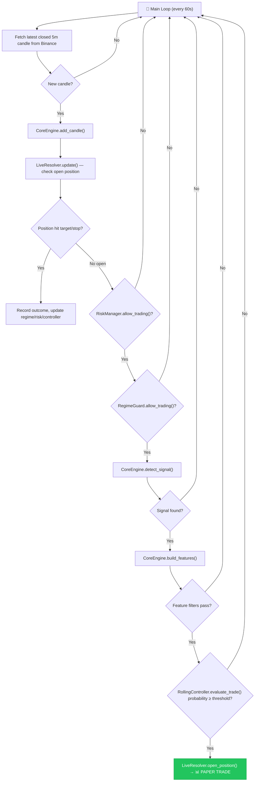

# PAI-Lab — Full Evaluation & Al Brooks Strategy Compliance

## Part 1: Bug Fixes Applied (v0.2.0)

| # | File | Bug | Fix |
|---|------|-----|-----|
| 1 | [live_runner.py](file:///d:/MyProjects/PAI-Lab/live_runner.py) | `pd.DataFrame` used but `pandas` never imported → **crash** | Added `import pandas as pd` and `from datetime import datetime` |
| 2 | [resolvers.py](file:///d:/MyProjects/PAI-Lab/execution/resolvers.py) | Stop/target always computed for long direction → **bearish trades broken** | Both [LiveResolver](file:///d:/MyProjects/PAI-Lab/execution/resolvers.py#57-109) and [BacktestResolver](file:///d:/MyProjects/PAI-Lab/execution/resolvers.py#25-51) now flip stop/target for bearish direction |
| 3 | [feature_extractor.py](file:///d:/MyProjects/PAI-Lab/core/feature_extractor.py) | `.hour` called on Unix ms integer → **crash in live mode** | Auto-detects int vs datetime and converts accordingly; also guards empty impulse slice |
| 4 | [risk_manager.py](file:///d:/MyProjects/PAI-Lab/execution/risk_manager.py) | `daily_returns` never reset → **permanent trading halt** | Added 24-hour session reset + cooldown-based recovery from streak/daily stops |
| 5 | [main.py](file:///d:/MyProjects/PAI-Lab/main.py) | [resolve()](file:///d:/MyProjects/PAI-Lab/execution/resolvers.py#30-51) didn't pass direction → **bearish outcomes wrong** | Now passes `direction` to `BacktestResolver.resolve()` |

---

## Part 2: How the Code Gets to a Paper Trade

### What Each Gate Does (Al Brooks Context)

| Gate | Module | What It Checks |
|------|--------|----------------|
| **Signal Detection** | [SecondEntryDetector](file:///d:/MyProjects/PAI-Lab/pai_engine.py#194-287) | Pullback → reversal bar with strong close in bias direction |
| **Environment Filter** | [MarketEnvironmentClassifier](file:///d:/MyProjects/PAI-Lab/pai_engine.py#289-344) | H2 only in structural bull, L2 only in structural bear |
| **Pullback Depth** | `CoreEngine.build_features()` | `depth / ATR ≥ 1.0` (meaningful pullback) |
| **Pullback Duration** | `CoreEngine.build_features()` | 2-4 bars (controlled correction) |
| **AI Probability** | [RollingController](file:///d:/MyProjects/PAI-Lab/intelligence/rolling_controller.py#7-95) | Logistic regression on 6 features ≥ adaptive threshold |
| **Regime Guard** | [RegimeGuard](file:///d:/MyProjects/PAI-Lab/execution/regime_guard.py#4-96) | Z-score of recent edge vs baseline ≥ -1.0 |
| **Risk Manager** | [RiskManager](file:///d:/MyProjects/PAI-Lab/execution/risk_manager.py#6-128) | No hard capital stops triggered |

---

## Part 3: Al Brooks H2/L2 Compliance Analysis

### ✅ What IS Correctly Implemented

| Brooks Concept | Implementation | Location |
|---|---|---|
| **H2 = second push back up after pullback in bull trend** | [SecondEntryDetector](file:///d:/MyProjects/PAI-Lab/pai_engine.py#194-287) finds pullback bars then looks for a strong reversal signal bar | [pai_engine.py:194-286](file:///d:/MyProjects/PAI-Lab/pai_engine.py#L194-L286) |
| **Structural trend context required** | [MarketEnvironmentClassifier](file:///d:/MyProjects/PAI-Lab/pai_engine.py#289-344) checks HH/HL for bull, LH/LL for bear | [pai_engine.py:289-343](file:///d:/MyProjects/PAI-Lab/pai_engine.py#L289-L343) |
| **Signal bar quality** | Checks close position (>0.7 for bull) and body ratio (>0.5) | [pai_engine.py:270-276](file:///d:/MyProjects/PAI-Lab/pai_engine.py#L270-L276) |
| **Entry above signal bar** | `entry_price = candle["high"]` (stop entry above high) | [live_runner.py:164](file:///d:/MyProjects/PAI-Lab/live_runner.py#L166) |
| **Fixed ATR-based risk** | 1 ATR target, 1.3 ATR stop (≈0.77 R:R, needs ~57% win rate) | [config.py](file:///d:/MyProjects/PAI-Lab/config.py) |
| **Bearish symmetry (L2)** | Now supported in both CoreEngine and resolvers | Multiple files |

### ⚠️ Partially Implemented / Simplified

| Brooks Concept | Current State | What's Missing |
|---|---|---|
| **"Second" entry counting** | Counts consecutive pullback bars but doesn't explicitly count H1 vs H2 | Brooks defines H2 as the **2nd attempt** to reverse the pullback — this code doesn't track the first failed attempt (H1) explicitly |
| **Trend bar vs doji distinction** | Uses `body > 1.2 × avg_body` as "strong" | Brooks uses more nuanced reading: tails, relative position in range, overlap with prior bars |
| **Pullback quality** | Filters by depth (1 ATR) and duration (2-4 bars) | Brooks also considers: overlap, two-legged nature, whether bars are dojis vs trend bars, channel behavior |

### ❌ Not Implemented (Key Brooks Concepts)

| Missing Concept | Why It Matters |
|---|---|
| **Measured Move targets** | Brooks uses prior leg length for targets, not fixed ATR multiples |
| **Trading Range detection** | Current classifier is binary (trend/range). Brooks emphasizes **not** taking H2 setups inside tight trading ranges |
| **Wedge / 3-push patterns** | Brooks' strongest reversals. The current system has no wedge detection |
| **Gap analysis** | Opening gaps, measuring gaps — important context Brooks uses |
| **Two-legged pullbacks** | Brooks specifically wants the pullback to have two distinct legs. Current code counts bars mechanically |
| **Follow-through assessment** | Brooks judges signal bars by the follow-through bar. Current system enters on the signal bar's high without waiting |
| **High/Low of Day context** | Brooks heavily uses first-hour context, prior day range. Not present |
| **Always-in direction** | Central Brooks concept: is the market "always in long" or "always in short"? Partially captured by [TrendAnalyzer](file:///d:/MyProjects/PAI-Lab/pai_engine.py#20-55) but not formalized |
| **Scalp vs swing decision** | Brooks adjusts targets based on context quality. Current system uses fixed 1 ATR always |

---

## Part 4: Verdict

### Architecture Grade: **B+**
The modular design is clean. Separation of signal detection, feature extraction, probability gating, regime filtering, and risk management is well-architected. The pipeline flow from candle → signal → features → AI filter → trade is logically sound.

### Al Brooks Compliance Grade: **C+**
The system captures the **skeleton** of an H2 trade (pullback in trend → reversal bar → enter above). But Al Brooks' methodology is deeply contextual — the same H2 shape in different market contexts gets very different treatment. The code currently:
- Treats all H2 signals equally (the AI filter partially compensates)
- Uses mechanical filters where Brooks uses contextual judgment
- Misses several signal quality dimensions Brooks considers critical

### 24-Hour Viability (after fixes): **A-**
With the bugs fixed, the system can run 24 hours. The remaining concerns are:
- No state persistence in live mode (crash = loss of all state)
- No log rotation (minor for 24h, matters for weeks)
- Network interruptions handled with basic retry only

> [!TIP]
> The **AI probability layer** partially compensates for missing Brooks context — it learns feature-outcome correlations from trade history, effectively discovering which H2 setups work and which don't. This is a smart architectural shortcut, but it needs ~100 trades of training data before it starts filtering.
